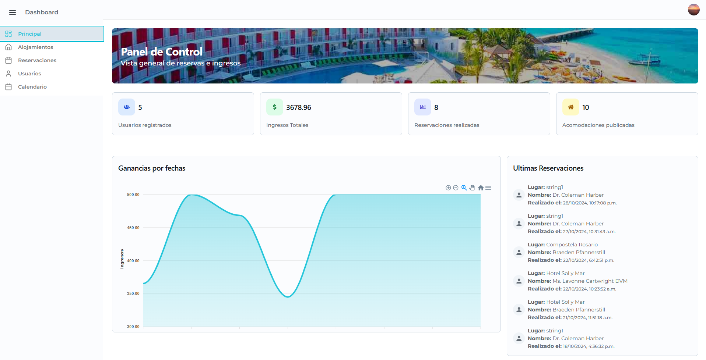
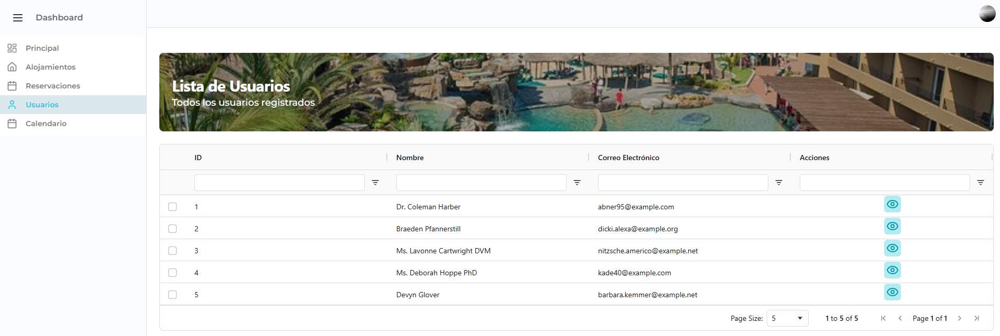
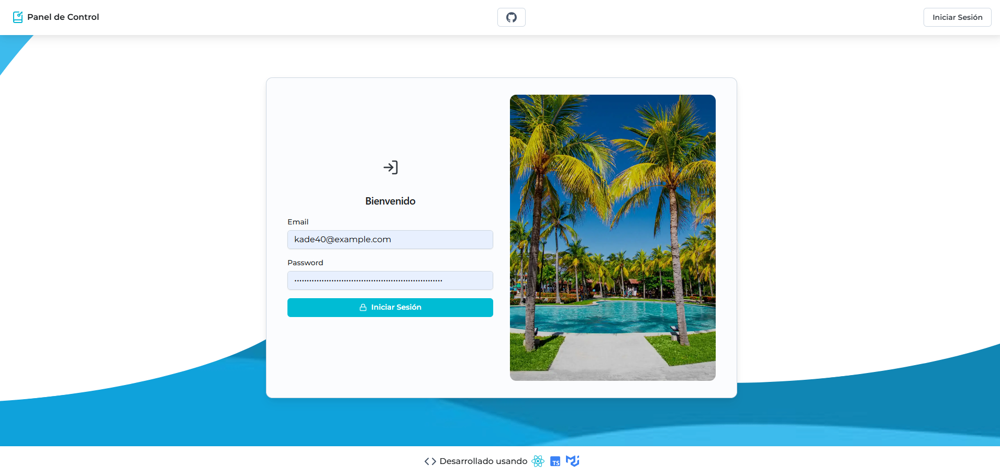

# Panel de reservaciones - React + TypeScript + Material UI

Tarea asignado en Kodigo Academy.

#### Integrantes

- luis nativi
- Marcela Carolina Menjívar Gutiérrez
- [Marcos Alfaro](https://github.com/1frencho)
- Orlando Josue Palacios Valladares
- Oscar Miguel Lara Zelaya
- Erick Alexander Montoya Cruz

## Sistema de Reservaciones junto a la API asignada:

### https://apibookingsaccomodations-production.up.railway.app/api/documentation

### Panel de Control



### Tablas usadas:

#### AG-Grid-Community (Tablas)

- Filtros
- Orden de columnas
- Búsqueda de texto
- Paginación



### Inicio de Sesión

#### Autenticación basada:

- Token
- Sesión de usuario
- Peticiones usando AXIOS hacia los EndPoints asignados con Token de Autorización.



## Librerías y paquetes usados:

- Tailwind CSS
- Material Joy UI
- Ag-grid-community (Tablas)
- Framer Motion
- React Hook Form (Task applied on Auth Form)
- Yup with React Hook Form
- React Router
- React Icons
- Redux Toolkit

## Trabajo en el área de trabajo:

```
npm install
```

```
npm run dev
```
