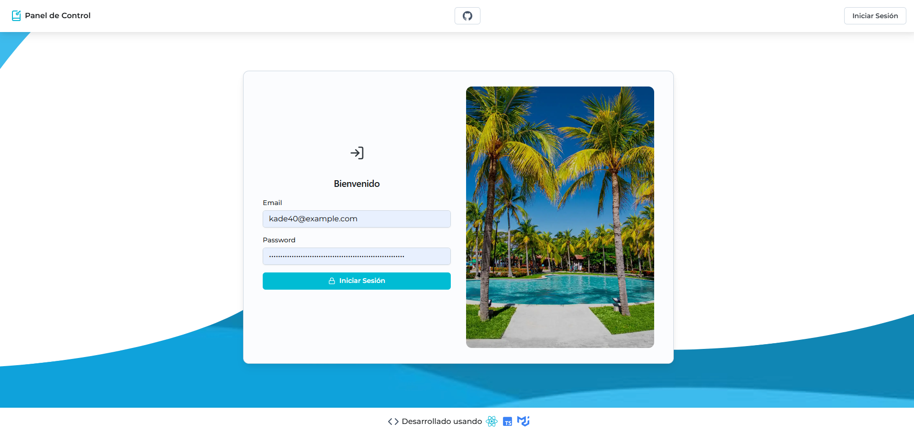
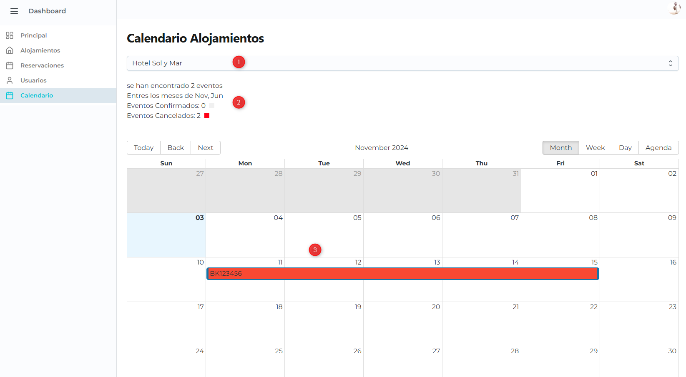
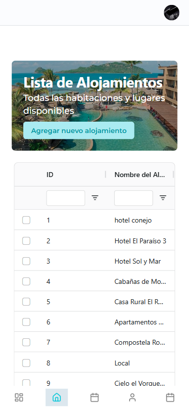
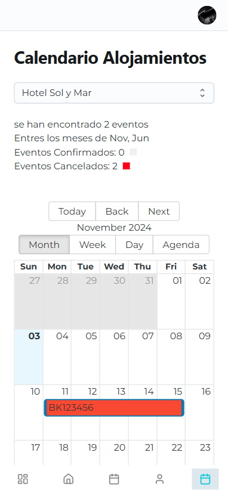

# Panel de reservaciones - React + TypeScript + Material UI

- Academia de Kodigo.
  Tarea asignada como parte del bootcamp de Full Stack Jr

#### Integrantes

- Marcela Carolina Menjívar Gutiérrez
- [Marcos Alfaro](https://github.com/1frencho)
- Orlando Josue Palacios Valladares
- Oscar Miguel Lara Zelaya
- Erick Alexander Montoya Cruz

## Sistema de Reservaciones junto a la API asignada:

### https://apibookingsaccomodations-production.up.railway.app/api/documentation

### Panel de Control


### Resumen de datos por tablas:


#### AG-Grid-Community (Tablas)

- Filtros
- Orden de columnas
- Búsqueda de texto
- Paginación

### Inicio de Sesión



#### Autenticación basada:

- Token
- Sesión de usuario
- Peticiones usando AXIOS hacia los EndPoints asignados con Token de Autorización.

## Librerías y paquetes usados:

- Tailwind CSS
- Material Joy UI
- Ag-grid Edición de comunidad (Tablas)
- Framer Motion
- React Hook Form
- Yup con React Hook Form
- React Router
- React Icons

## Calendario:

- Libreria react-big-calendar

Paso 1. Seleccionas del Combo la acomodacion de la que quieres ver las reservas. <br>
Paso 2. Te muestra resumen de las reservas realizadas a la acomodacion (total, meses en donde se  encuentran, total confirmadas, total canceladas) <br>
paso 3. muestra las entradas de las resevas.



## Mobile:

Aplicativo Responsive en la vista Desktop y la vista de dispositivos Mobiles.
se ha utilizado Material UI/Joy.

### Mobile View 1


### Mobile View 2


### Mobile View 3


### Mobile View 4



## Desarrollo en el área de trabajo:

```
npm install
```

```
npm run dev
```
